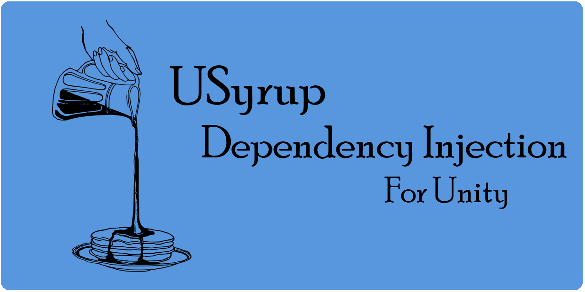
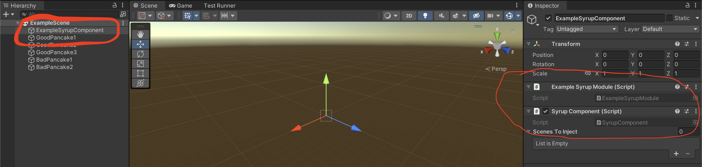

# USyrup - Dependency Injection



[](https://openupm.com/packages/com.cannone.usyrup/)

# Introduction

USyrup is a dependency injection framework designed for the Unity Game Engine. It's heavily inspired by Java's Guice/Dagger DI frameworks, co-opting similar such semantics from those libraries. The core problem that USyrup attempts to address is simplicity. Many dependency injection frameworks that currently exist are both incredibly feature rich and even more so complicated. USyrup's simplicity makes DI much more approachable and actually benefits a project instead of creating dependency confusion.

# Table of Contents

---
<details>
<summary>Details</summary>

- [Introduction](#introduction)
- [How it works](#how-it-works)
- [Installation](#installation)
- [Quick Start Guide](#quick-start-guide)
- [Features](#features)
    - [Modules (Syrup Modules)](#modules-syrup-modules)
    - [Provides (Attribute)](#provides-attribute)
    - [Named (Attribute))](#named-attribute)
    - [Inject (Attribute)](#inject-attribute)
        - [Constructor Injection](#constructor-injection)
        - [Field, Property, and Method Injection](#field-property-and-method-injection)
            - [Injecting MonoBehaviours](#injecting-monobehaviours)
            - [Property Validation](#property-validation)
            - [Constructor Injection Post-Step](#constructor-injection-post-step)
            - [Injection Heirarchies](#injection-heirarchies)
    - [Singleton (Attribute)](#singleton-attribute)
    - [Declarative Bindings](#declarative-bindings)
        - [Declarative Semantics](#declarative-semantics)
    - [SceneInjection (Attribute)](#sceneinjection-attribute)
    - [Containers](#containers)
        - [LazyObject Containers](#lazyobject-containers)
        - [Constructing LazyObjects Directly](#constructing-lazyobjects-directly)
    - [Syrup Component](#syrup-component)
    - [Syrup Injector](#syrup-injector)
        - [On-Demand Injection](#on-demand-injection)
    - [Caveats](#caveats)
- [Where is 'X' dependency injection framework feature?](#where-is-x-dependency-injection-framework-feature)
- [Why the name "Syrup"?](#why-the-name-syrup)
- [Development Documentation](#development-documentation)
</details>

---

# How It Works

USyrup is a runtime dependency injection framework, much like Guice. It uses modules (called "Syrup Modules") for explicitly provided dependencies and constructor injection for the rest. MonoBehaviours can be injected like any other object through the use of members injection (for fields, properties, and methods), an approach similar to how Zenject handles injection. 

Custom Syrup Modules are written and attached to a game object with the USyrup provided Syrup Component, which reads in the modules and uses them to construct your dependency graph. The graph is then validated to ensure all provided dependencies can be fulfilled and then injects the dependencies into each injectable MonoBehaviour in the scene.

# Installation

1. Install through [OpenUPM](https://openupm.com/packages/com.cannone.usyrup/#close)
2. Through the Unity Package Manager directly:
 - Add the package using the git URL of this repo: https://github.com/Jeffan207/usyrup.git
 - Download the tarball from the [releases](https://github.com/Jeffan207/usyrup/releases) page and install through that.
3. [Unity Asset Store](https://assetstore.unity.com/packages/slug/231289) 

# Quick Start Guide

1. In your MonoBehaviour where you want your dependencies injected, create a new `void` method and annotate it with the `[Inject]` attribute. The parameters for the method will be the dependencies that USyrup will inject into the MonoBehaviour. An example of such MonoBehaviour is shown below.

```c#
public class Breakfast : MonoBehaviour {

    private Pancakes pancakes;

    //..Awake(), Start(), Update()...

    [Inject]
    public void Init(Pancakes pancakes) {
        this.pancakes = pancakes;
    }
}
```

2. Create a new module for your scene to house your dependencies. The module must extend the `ISyrupModule` interface and be a `MonoBehaviour`. You can use the example below as a template of how a basic module might look.

```c#
public class ExampleSyrupModule : MonoBehaviour, ISyrupModule {
    [Provides]
    public Pancakes ProvidesPancakes(TastySyrup tastySyrup) {
        return new Pancakes(tastySyrup);
    }

    [Provides]
    public TastySyrup ProvidesTastySyrup() {
        return new TastySyrup();
    }
}
```
3. Create a new empty game object in your scene and attach the `Syrup Component` script and ***your*** Syrup Module that you created in step (2) to it.



4. Hit play! Your dependencies should be automatically injected when the scene starts!


# Features

## Modules (Syrup Modules)

Syrup Modules are the backbone of USyrup. In these modules, you can declare dependencies you wish you explicitly expose to your Syrup Component. USyrup will prioritize providing any dependencies declared here over any dependencies that might be provided via other means (like constructor injection). These modules should be attached to the same game object in your scene that contains a Syrup Component MonoBehaviour.

Modules are simple MonoBehaviours that implement the `ISyrupModule` interface (and empty interface).

```c#
public class ExampleSyrupModule : MonoBehaviour, ISyrupModule {
    //This is technically a valid module!
}
```

A Syrup Component can take in any number of modules and modules themselves can provide dependencies to other modules, so feel free to break your modules up if they grow too big.

## Provides (Attribute)

The "Provides" attribute is used within Syrup Modules. Any public method inside a SyrupModule that is annotated with `[Provides]` indicates that the method is to be used to supply dependencies. The type of the dependency provided is determined by return type of the method. These methods are also known as "Provider" methods. A provider method can also provide dependencies to other provider methods, creating a hierarchy of dependencies. Neat!

```c#
public class ExampleSyrupModule : MonoBehaviour, ISyrupModule {
    
    [Provides]
    public Breakfast ProvidesBreakfast(Omelette omelette) {
        // The omelette is always supplied by the omelette provider method declared below!
        return new Breakfast(omelette);
    }

    [Provides]
    public Omelette ProvidesOmelette() {
        return new Omelette()
    }
}
```

Providers that are **NOT** also annotated with a `[Singleton]` attribute will supply a new instance of the dependency everytime that dependency is needed. For example, if the `Breakfast` dependency is needed three separate times, three unique `Omelette` objects will be instantiated to supply three unique `Breakfast` objects.

## Named (Attribute)

Sometimes it's required to have two provider methods that provide dependencies of the same type. Without doing anything else, this scenario will create an ambiguous injection since the Syrup Injector won't know which provider it should be using. 

These cases can be worked around by using the `[Named]` attribute on provider methods, along with any human-readable name. Any provider method with this attribute will be disambiguated from other provider methods that have the same return type. In order to use the dependency from this named provider method, you must declare any parameters supplied to other providers/injected constructors with the `[Named]` attribute as well.

The following example illustrates this more clearly

```c#
public class ExampleSyrupModule : MonoBehaviour, ISyrupModule {
    
    [Provides]
    public Breakfast ProvidesBobsBreakfast([Named("ScrambledEggs")] EggDish eggDish) {
        return new Breakfast(eggDish);
    }

    [Provides]
    public Breakfast ProvidesAlicesBreakfast([Named("SunnySideUpEggs")] EggDish eggDish) {
        return new Breakfast(eggDish);
    }

    [Provides]
    [Named("ScrambledEggs")]
    public EggDish ProvidesScrambledEggs() {
        return new EggDish("Scrambled");
    }

    [Provides]
    [Named("SunnySideUpEggs")]
    public EggDish ProvidesSunnySideUpEggs() {
        return new EggDish("SunnySideUp");
    }
}
```

Above, both Bob and Alice want an egg `Breakfast`. Bob wants scrambled eggs, and Alice wants sunny-side-up eggs (yuck). Our `Breakfast` object now takes in an `EggDish` type which itself takes in a custom string indicating what unique flavor of a dish it is. To disambiguate which `EggDish` goes to Bob and which to Alice, we annotate each provider with a `[Named]` attribute indicating which exact flavor of `EggDish` the method is providing. In Bob and Alice's `Breakfast` providers we annotate the `EggDish` parameters again with the `[Named]` attribute to indicate which flavor of eggs they want.

The `[Named]` attribute can also be used on injectable field/method/constructor parameters too!

```c#
public class TastySyrup {

    [Inject]
    public TastySyrup([Named("MapleSap") TreeSap sap]) {
        //...make the syrup
    }

}
```

The above is a perfectly valid use of the `[Named]` attribute! The `TastySyrup` class above can only be injected with a `TreeSap` provided by a `[Named]` `TreeSap` provider called **"MapleSap"**. You know, only the good stuff. But you can still technically call the constructor separately with any kind of TreeSap (it just won't be as good).

## Inject (Attribute)

The `[Inject]` attribute is the backbone of any DI framework and USyrup is no exception. Semantically, `[Inject]` can be used in two similar yet different contexts which we will cover separately. These are: constructor injection and method injection.

### Constructor Injection

Constructor injection is used when you wish for a type to be provided as a dependency without having to explicitly declare it in a provider method in your Syrup Module. Constructor injected objects can take in parameters that may either be explicitly provided in your module or constructor injected themselves. This sounds confusing, because it is, but hopefully the examples below will help illustrate.

```c#
public class ExampleSyrupModule : MonoBehaviour, ISyrupModule {
    
    [Provides]
    public Pancakes ProvidesPancakes(TastySyrup tastySyrup) {
        //The tasty syrup parameter is provided directly via
        //constructor injection.
        return new Pancakes(tastySyrup);
    }
}

public class TastySyrup {

    [Inject]
    public TastySyrup() {
        //This TastySyrup doesn't take in any arguments
        //so it can be constructed without much effort.
    }

}
```
Above, we have a simple example of constructor injection in action. Our `TastySyrup` contains a single `[Inject]` annotated constructor which our Syrup Injector will use to build it when it's necessary. Inside our module we have a provider method to make `Pancakes` (delicious), which requires some `TastySyrup`. Since we're using constructor injection, we don't need to declare a `TastySyrup` provider explicitly in our module since the framework uses the `[Inject]` annotated constructor to discover it and automatically add it to our dependency graph! Cool!

```c#
public class ExampleSyrupModule : MonoBehaviour, ISyrupModule {
    
    [Provides]
    public Pancakes ProvidesPancakes(TastySyrup tastySyrup) {
        //The tasty syrup parameter is provided directly via
        //constructor injection.
        return new Pancakes(tastySyrup);
    }

    [Provides]
    public TreeSap ProvidesTreeSap() {
        return new TreeSap();
    }
}

public class TastySyrup {
    [Inject]
    public TastySyrup(TreeSap treeSap) {
        //The TreeSap is provided via the provider
        //method in our module
    }

}
```

The above is a slightly modified version of our previous example. In this version, our `TastySyrup` now takes in a familiar parameter, `TreeSap`. Since we explicitly declare a TreeSap provider in our module, we use that to fulfill the `TreeSap` needed for `TastySyrup`'s constructor. The `TastySyrup` is then supplied to our `Pancakes` provider as normal. If you fail to provide a `TreeSap` dependency in your module, then your dependency graph will fail validation citing a `MissingDependency`. A side effect of providing dependencies to injected constructors this way is that swapping modules can swap concrete types that might be provided to `TastySyrup`. I.E., one module might provide the `MapleSap` implementation of `TreeSap` while another might provide `WillowSap` (eww).

*(Author's note: if you find constructor injection confusing still, you're not alone! In my experience the hardest thing for developers new to DI to grasp is how to trace dependencies provided by constructor injection. As your project grows, you might have constructor injected dependencies accept parameters from other constructor injected dependencies and maybe even some provider methods too...it can really get out of hand quickly. For this reason alone, I actually prefer to explicitly provide all my dependencies in the modules themselves via providers. That way if I want to trace how a dependency is built I just look at the module and find the associated provider(s) for it and its required types. And this is not just true for USyrup, but also for other frameworks like Dagger/Guice. I must warn you though, other engineers don't share my enthusiasm for modules as I do)*

### Field, Property, and Method Injection

Field, property, and method injection (also known as members injection) are similar to constructor injection except that return types of injected members in USyrup are not fed back into USyrup's dependency graph. What this means is that you can use members injection to feed dependencies into an object *only*. It's a one-way relationship! 

Members injection is used in two cases in USyrup:

1. As a way to inject dependencies into MonoBehaviours.
2. As a post-step to constructor injection. After an object's constructor is injected, any injectable members on the object will also be called.

#### Injecting MonoBehaviours

```c#
public class Pancakes : MonoBehaviour {
    
    [Inject]
    private Butter butter;
    
    [Inject]
    private Fruit FruitProp { get; set; }

    private TastySyrup tastySyrup;

    private void Awake() {
        //You can still init your injectable monobehaviours using awake/start
        Debug.Log("Serving up some pancakes for breakfast!");
    }

    [Inject]
    public void Init(TastySyrup tastySyrup) {
        this.tastySyrup = tastySyrup;
    }
}
```

Above is another pancake themed example illustrating how to inject dependencies into a MonoBehaviour. MonoBehaviour's cannot be instantiated via a traditional constructor, so instead we use `[Inject]` annotated members (field, property, and method) inside the MonoBehaviour to pass our dependencies through. Our MonoBehaviour `Pancakes` (naturally), has a single `[Inject]` annotated field of type `Butter`, a single `[Inject]` annotated propetty `Fruit`, and a single `[Inject]` annotated method `Init()` which takes in a `TastySyrup` object. USyrup will inject fields first, followed by propeties, and finally followed by methods when performing members injection on an object. In layperson's terms, USyrup will inject all `Pancakes` MonoBehaviours in our scene with `Butter`, `Fruit`, and `TastySyrup` objects based on the `[Inject]` annotated members in the MonoBehaviour. 

USyrup automatically detects all `[Inject]` annotated members attached to MonoBehaviours within the scene that need to be injected. So as long as you have your Syrup Component/Modules setup, it's enough to create a single `[Inject]` member on your MonoBehaviour, and you're good to go!

#### Property Validation

Property injection is functionally similar to field injection except that for injected properties USyrup will invoke the property's setter method. This allows you to create properties with custom validation logic, which can help spot a bad injected value.

```c#
public class Pancake {
    
    private Fruit fruit
    
    public Fruit FruitProp {
        get => fruit;
        set {
            if (fruit.type == Fruit.Banana) {
                throw new ArgumentException("I'm not bananas for bananas!");
            }
            fruit = value;
        }
    }
}
```

#### Constructor Injection Post-Step

Sometimes, you might want to do some additional work to finish building an object outside of constructor injection. You can do this by also supplying an `[Inject]` annotated field/method inside the class in addition to an `[Inject]` annotated constructor. USyrup will always invoke the `[Inject]` annotated constructor first, followed by injecting the `[Inject]` annotated member(s), with the order being constructor -> fields -> methods.

```c#
public class Pancake {

    //Second, the egg is injected
    [Inject]
    public Egg egg;
    
    // Third, the fruit is injected
    [Inject]
    public Fruit FruitProp;

    [Inject]
    public Pancake(Butter butter) {
        //First, this constructor is called
    }

    [Inject]
    public void Init(TastySyrup tastySyrup) {
        //Fourth, this injectable method is called
    }
}
```

#### Injection Hierarchies

An object can have any number of injectable members. USyrup will resolve all injectable members from base class to derived class, so any injectable members in a base class will be injected first, followed by any subclass(es). This is probably most convenient if you have a MonoBehaviour that derives from another MonoBehaviour that is required to be injected as well. You don't need to create duplicate `[Inject]` annotated members to fulfill base class dependencies!

```c#
public class Food : MonoBehaviour {

    [Inject]
    protected FoodName name;

    protected Brand brand;

    [Inject] //This inject method is always called first
    public void InitFood(Brand brand) {
        this.brand = brand;
    }
}

public class Waffle : Food {

    [Inject]
    private WaffleStyle waffleStyle;

    private TastySyrup tastySyrup;

    [Inject] //This inject method is called second, so you can be assured that 'brand' is always available if your subclass needs it!
    public void InitWaffle(TastySyrup tastySyrup) {
        this.tastySyrup = tastySyrup;
    }
}
```

Above we have a base class Food which has an `[Inject]` annotated method `InitFood()` and an injected `FoodName` field. Additionally, the `Waffle` class extends `Food` and also has its own `[Inject]` annotated method and field. USyrup will account for this and inject `Food`'s `[Inject]` field first then `Waffle's` field, followed by `Food`'s method, followed by `Waffle`'s method. In simple terms, in injection hierarchies, fields from base to deriving class are injected first, followed by methods in the same order.

## Singleton (Attribute)

If you want to reuse the same dependency instantiation across objects that use them, you can use the `[Singleton]` attribute. The `[Singleton]` attribute tells USyrup to only ever create one instance of that dependency and that instance is injected into all objects that request to `[Inject]` it. Unlike normal dependencies, singletons are created and cached when the graph is first validated. The `[Singleton]` attribute itself can be applied to both provider methods and classes. On classes, the attribute only applies for when the dependency is injected via constructor injection. If a provider is declared that overrides an injectable constructor with a `[Singleton]` attribute, the attribute will be ignored unless it is also applied to the provider method.

```c#
public class ExampleSyrupModule : MonoBehaviour, ISyrupModule {
    [Provides]
    [Singleton]
    public TastySyrup ProvidesTastySyrup() {
        return new TastySyrup();
    }
}

[Singleton]
public class Butter {
    [Inject]
    public () {}
}
```

The above example shows both uses of the `[Singleton]` attribute. On the provider, only a single `TastySyrup` will only be created from that provider method and will be re-used across the dependencies that require it. On the `Butter` class we annotate the class itself with the `[Singleton]` attribute to denote that this class should only ever be constructor injected once.

## Declarative Bindings

In addition to hosting `Provides` annotated methods, Syrup Modules can also declare injectable objects via declarative bindings in a module's `configure()` method. These bindings provide convenient shorthand for declaring injections without using the much wordier `Provides` method alternative.

```c#
public class ExampleSyrupModule : MonoBehaviour, ISyrupModule {
    public void Configure(IBinder binder) {
        binder.Bind<Pancake>().To<BlueberryPancake>();
    }
}
```

A good use for declarative bindings is binding abstract types to concrete types. In the above example, `Pancake` is bound to `BlueberryPancake`, so any injections asking for a `Pancake` will receive a `BlueberryPancake` instance! This is also technically possible with `Provides` methods, but there are some drawbacks.

```c#
public class ExampleSyrupModule : MonoBehaviour, ISyrupModule {
    [Provides]
    public Pancake ProvidesPancake(Blueberry blueberry, TastySyrup tastySyrup) {
        return new BlueberryPancake(blueberry, tastySyrup);
    }
}
```

Above, we declare a `Provides` method that returns a concrete `BlueberryPancake` type. This works, but notice that the `Blueberry` and `TastySyrup` objects need to be supplied as arguments to the `Provides` method directly. I.E., we forgo the ability to inject members of `BlueberryPancake` and need to construct it directly. In real world Unity usages, most injectable objects are going to be `MonoBehaviour`s where direct construction is not possible, so declarative bindings allow us to map abstract to concrete types while still enabling injection of those concrete types.

**Note:** declarative bound dependencies still need to be provided somewhere as an injectable object, either via an `Inject` annotated constructor or a `Provides` annotated method. 

### Declarative Semantics

Declarative bindings have all the same semantics that `Provides` methods and `[Inject]` annotated constructors have such as being able to mark those dependencies as `Singleton` and `Named`.

```c#
public class ExampleSyrupModule : MonoBehaviour, ISyrupModule {
    public void Configure(IBinder binder) {
        binder.Bind<Pancake>().To<BlueberryPancake>().Named("FunPancakes").AsSingleton();
    }
}
```

Like `Provides` methods, you can also give the binding an already created instance that's passed directly into your module. 

```c#
public class ExampleSyrupModule : MonoBehaviour, ISyrupModule {
    
    [SerializeField]
    private Pancake pancake;
    
    public void Configure(IBinder binder) {
        binder.Bind<Pancake>().toInstance(pancake)
    }
}
```

In this case you wouldn't need to bind `Pancake` to a concrete subtype as it already has an object provided.

Declarative bindings are flexible, and the same binding can be expressed in many ways.

```c#
public class ExampleSyrupModule : MonoBehaviour, ISyrupModule {
    
    public void Configure(IBinder binder) {
        // Self binds the BlueberryPancake type, useful if BlueberryPancake doesn't declare an `[Inject]` 
        // annotated constructor and you have enableAutomaticConstructorSelection set to `true`.
        binder.Bind<BlueberryPancake>()
            
        // You can also use normal semantics with self-binds, like AsSingleton() and Named().
        bind.Bind<BlueberryPancake>().AsSingleton()
            
        // Another way to write binder.Bind<Pancake>().to<BlueberryPancake>()
        binder.Bind<Pancake, BlueberryPancake>()
    }
}
```

**Note:** `enableAutomaticConstructorSelection` is a useful Syrup Component flag that you can set that will automatically pick any parameterless or default/no-arg constructor declared in an object, even if they aren't annotated with `[Inject]` (barring that there is only one such constructor). This flag is only available for declarative bindings!

## SceneInjection (Attribute)

The `[SceneInjection]` attributes controls whether the object will be injected when the scene is loaded. By default, all MonoBehaviours are treated as if `SceneInjection.enabled` is set to `true`, even if the `[SceneInjection]` attribute isn't declared on the MonoBehaviour itself. When the `[SceneInjection]` attribute is provided with the enabled field set to `false`, then USyrup will skip injecting the MonoBehaviour when the scene is loaded. So outside of being more explicit, the only time you would want to use this attribute is if you wanted to conditionally disable scene injection. You would generally do this for objects that are created at runtime or if you want to rely on on-demand style injection instead.

```c#
[SceneInjection(enabled: false)]
public class Food : MonoBehaviour {

    private Brand brand;

    private void Start() {
        this.brand = SyrupComponent.SyrupInjector.Get<Brand>();
    }

    [Inject]
    public void InitFood(Brand brand) {
        this.brand = brand;
    }
}
```

In the above example, the `Food` object has an injectable `InitFood()` method. However, we have explicitly disabled scene injection with the attribute `[SceneInjection(enabled: false)]`. So instead the object fulfills it's dependency by using `SyrupInjector.Get<>()`.

## Containers

### LazyObject Containers

`LazyObject` containers are special wrapper objects that allow you to inject your objects now, but construct them later. This is useful if you have a dependency that has a long construction time that you want to offload until it's actually necessary. To use `LazyObject` all you need to do is wrap your injected types with the `LazyObject<>` type at your injection sites.

```c#
public class ExampleSyrupModule : MonoBehaviour, ISyrupModule {
    
    // TastySyrup is provided directly, without being wrapped in an LazyObject
    [Provides]
    [Named("Maple")]
    public TastySyrup ProvidesTastySyrup() {
        return new TastySyrup();
    }
}
public class Pancake {    
    // We can choose to inject our TastySyrup wrapped in a LazyObject container with
    // zero additional work needed to enable this
    [Inject]
    [Named("Maple")]
    LazyObject<TastySyrup> syrup;

    // pretend we inject this on-demand somewhere
}
```

In the above example, `TastySyrup` is provided directly via a `Provider` Module. Note how we do not need to return `LazyObject<TastySyrup>` from `ProvidesTastySyrup()`, this wrapping is done under the hood by the `SyrupInjector` at injection time. In fact, if we tried to provide a `LazyObject` instance directly then the `SyrupInjector` would throw an exception and direct you to use the `LazyObject` container at your injection site instead. Once we have the `LazyObject` injected, we only need to call `.Get()` on the container to retrieve a concrete instance of the contained type.

```c#
LazyObject<TastySyrup> lazySyrup;

public void PourSyrup() {
    TastySyrup syrup = lazySyrup.Get();
    // Pour syrup on our pancakes
}
```

The instance retrieved by `.Get()` will be cached on the `LazyObject` container, so subsequent calls to `.Get()` will always yield the same object instance. `LazyObject` wrapped dependencies that are provided by `[Singleton]` annotated sources will be `Singleton`s themselves along with the underlying contained instances they wrap.

### Constructing LazyObjects Directly

Like all injections, `LazyObject` wrapped dependencies can be injected via on-demand injection as well.

```c#
LazyObject<TastySyrup> tastySyrup = SyrupInjector.GetInstance<LazyObject<TastySyrup>>();
```

This is cumbersome to write for obvious reasons, so you can use a shorthand `new()` on the `LazyObject` type directly.

```c#
LazyObject<TastySyrup> tastySyrup = new();
```

This creates a new `LazyObject` containing your desired type directly. However, there are a few drawbacks of this approach that are worth considering:

1. Normally, when the injected type is a `Singleton` then the `LazyObject` itself is also a `Singleton`. If you create a `LazyObject` directly (as shown above) then the `LazyObject` container won't be a `Singleton`, but the underlying injected type will be. This could have consequences of adding additional memory usage to your game when creating multiple `LazyObject` containers of the same nominal injected type.
2. When the SyrupInjector builds the dependency graph initially on the initial scene load, it will attempt to validate that all requested dependencies in the graph are injectable (i.e., all requested dependencies are provided somewhere). If you construct a `LazyObject` manually you won't get this kind of protection as your object you want to inject might actually be missing a required dependency. In these cases you will be met with a runtime `MissingDependencyException` instead at injection time, which can be later in your application's lifecycle than desired.

For these above reasons, it's not recommended to use `new()` to construct your `LazyObject`s unless you have a good reason to.

## Syrup Component

The Syrup Component is a MonoBehaviour that sits in your scene(s) and holds your Syrup Modules. On `Awake()`, the Syrup Component loads all Syrup Modules that are also attached to the same game object as itself and builds/validates your dependency graph. On `Start()` all MonoBehaviours in your scene with `[Inject]` annotated methods will be injected. Any other MonoBehaviour that is either also attached to the same game object as the Syrup Component or attached to a game object that is a child of the Syrup Component game object will not be injected. This is because it is assumed that these objects will either be full-formed or can easily be formed by hand inside your Syrup Module directly.

The Syrup Component itself has the following tunable parameters:

| Parameter                              | Type           | Description                                                                                                                                                                                                                                                                    |
|----------------------------------------|----------------|--------------------------------------------------------------------------------------------------------------------------------------------------------------------------------------------------------------------------------------------------------------------------------|
| Scenes To Inject                       | `List<String>` | A list of scenes that this Syrup Component is responsible for injecting. If not set, all game objects in all loaded scenes will be injected. Set this if you plan to load your scenes additively so you don't double inject your existing objects.                             |
| Use Scene Injection                    | `bool`         | Flag that indicates whether or not the Syrup Component should inject objects when the scene loads. Default: `true`. This flag is useful if you don't want to use scene injection at all and don't want to add the `[SceneInjection(enabled: false)]` attribute to every object |
| Verbose Logging                        | `bool`         | Flag that controls how verbose the console logging by should be for the Syrup Component and the Syrup Injector created by the component. Default: `false`                                                                                                                      |
| Inject in Awake                        | `bool`         | Flag that controls whether or not to run scene injection during the `Awake()` step instead of `Start()`. Default: `false`.                                                                                                                                                     |
| Enable Automatic Constructor Selection | `bool`         | Flag that controls whether or not declarative bindings can automatically select an empty/parameterless constructor if it exists. Default: `false`.                                                                                                                             |


## Syrup Injector

The Syrup Injector lives within the Syrup Component. It is responsible for building the dependency graph and fetching/caching any dependencies as they are needed. It is created on the first scene load and is destroyed in `OnDestroy()` when the scene transitions (meaning your dependencies are recreated between scenes). The Syrup Injector is a singleton, and any new Syrup Components and Modules added to your scene will be added directly to the currently active Syrup Injector.

If you need to, you can fetch dependencies directly from the Syrup Injector on your Syrup Component via static calls to the `SyrupInjector` property in the `SyrupComponent` class. You can use the Syrup Injector to fetch both unnamed and named dependencies using the `GetInstance<>()` and `GetInstance<>(string name)` methods respectively.

```c#
//Get's an instance of the TastySyrup object supplied by the Syrup Injector.
TastySyrup tastySyrup = SyrupComponent.SyrupInjector.GetInstance<>();

//Get's the named Milk dependency called "LactoseFreeMilk" from the Syrup Injector
Milk milk = SyrupComponent.SyrupInjector.GetInstance<>("LactoseFreeMilk")l

```

### On-Demand Injection

For convenience, the Syrup Injector can also be used to inject any object on-demand using the `SyrupInjector.Inject(T objectToInject)` API. This is useful for scenarios where the object to be injected is created at runtime and is not able to be injected during the Syrup Component's initial inject on scene load step. It also means for this scenario you can use normal `[Inject]` semantics instead of needing to rely on `SyrupInjector.GetInstance()` calls to fulfill your object's dependencies.

```c#
//This is an example WITHOUT using on-demand injection
public class Breakfast : MonoBehaviour {

    private Syrup syrup;
    private Pancakes pancakes;
    private Bacon bacon;

    private void Start() {
        this.syrup = SyrupComponent.SyrupInjector.GetInstance<Syrup>();
        this.pancakes = SyrupComponent.SyrupInjector.GetInstance<Pancakes>();
        this.bacon = SyrupComponent.SyrupInjector.GetInstance<Bacon>();
    }
}

//This is an example WITH using on-demand injection
public class Breakfast : MonoBehaviour {

    private Syrup syrup;
    private Pancakes pancakes;
    private Bacon bacon;

    private void Start() {
        SyrupComponent.SyrupInjector.Inject(this);
    }

    [Inject]
    public void InitBreakfast(Syrup syrup, Pancakes pancakes, Bacon bacon) {
        this.syrup = syrup;
        this.pancakes = pancakes;
        this.bacon = bacon;
    }
}
```

The above examples show the `Breakfast` class implemented in two ways. The first way using `SyrupInjector.GetInstance()` to fulfill the `Breakfast` class' dependencies and a second way using `SyrupInjector.Inject(this)`. Using the second method, the SyrupInjector will call back into the `Breakfast` class and invoke it's injectable `InitBreakfast()` method with the dependencies it needs to provide. As can be seen, one way is not strictly better than the other as both can be used to achieve the same goal. 

## Caveats

By default, USyrup builds the dependency graph during the `Awake()` step and injects your MonoBehaviours during `Start()`. This means when the scene loads you shouldn't expect any dependencies to be available to use in your MonoBehaviours until at least `Start()`. However, the Syrup Component's default script execution order is set to `-900` meaning this is true only for scene injection and not on-demand injection. During `Awake()` you can on-demand inject any dependency, however, be mindful they may not be fully initialized yet (particularly important for injected MonoBehaviours) as their own `Awake()` step may not have run.

Alternatively, if you build your own Syrup Injector outside the Syrup Component context via:

```c#
SyrupInjector syrupInjector = new SyrupInjector(
    new SomeModule1(),
    new SomeModule2(),
    ...
);
```

Then your injections are not bound to the Syrup Component's execution order, you can inject immediately. (but this doesn't really work within the context of MonoBehaviours/Unity and isn't as efficient as relying on the Syrup Component elsewhere in your scene).

## Where is 'X' dependency injection framework feature?

USyrup is meant to be *SIMPLE*! In the interest of simplicity (and time) only the most basic dependency injection features were implemented. This is a very opinonated viewpoint as I, (the author), only ever really use these features anyway.

If you feel strongly, the framework can really benefit from having 'X' feature, feel free to make a request!

My personal take has always been, however, "just because a framework/tool provides a number of features doesn't mean you need to or should use *ALL* of them!"

## Why the name "Syrup"?

Three reasons:

1. The framework was heavily inspired by both Guice/Dagger. Since it's a runtime dependency injection framework, similar to Guice, I chose a name with a similar food-ish connotation. The alternative name was Dirk (a type of dagger)...but maybe that can be saved for a compile time variant of this framework if I ever make it.
2. I have a sneaking suspicion this framework probably isn't the fastest DI framework out there (syrup is viscous).
3. I get a chuckle out of thinking about injecting syrup into things. Delicious!

# Development Documentation

The documentation below this point is for myself, so I remember the process on how to update the Unity Asset.

## Updating the Built-In Unity Documentation

As per Unity guidelines, documentation needs to ship with each asset inside the source directory. The guidelines also disallow using Markdown as the documentation format...so instead of duplicating the docs here we use `pandoc` to convert this Markdown file into an RTF file and then place that file inside our source.

You can get pandoc via Homebrew:

```bash
brew install pandoc
```

Once you have made your doc changes, you can run the documentation_generate script under the Assets/ folder.

```bash
./documentation_generate.sh
```

This will overwrite the existing generated docs and drop them in the correct directory. Note: the doc images won't crosslink properly in the RTF file, this is okay!

## Uploading a New Asset Store Version

1. Make sure to update the package.json to a new semantic version.
2. Go to the Unity Publisher Portal page for the USyrup package.
3. Click the button to use the asset store tool to upload a new version of the package.


